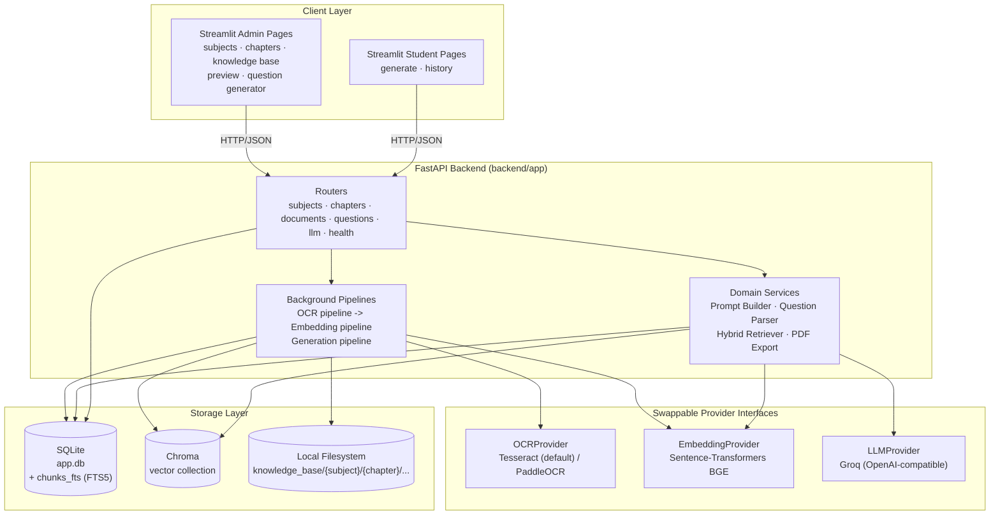
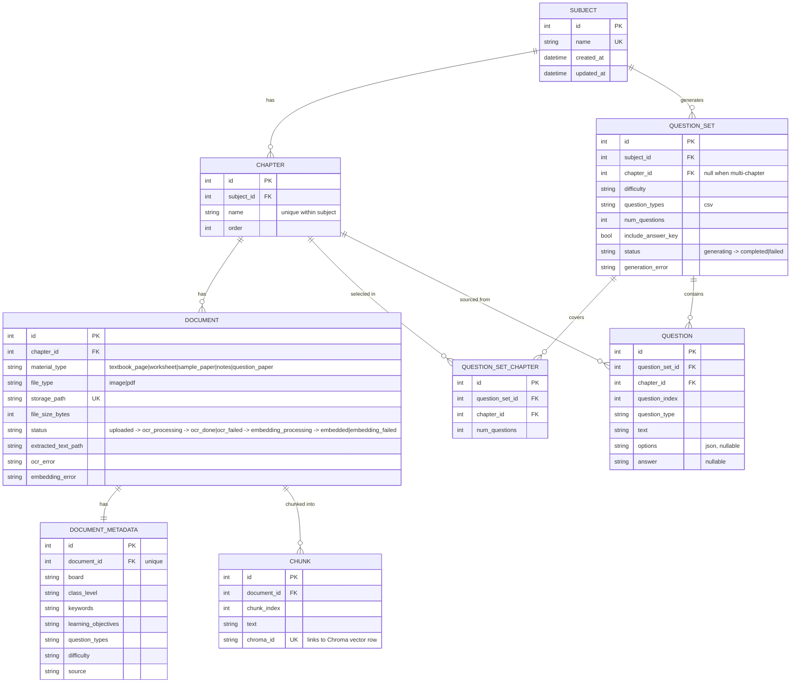
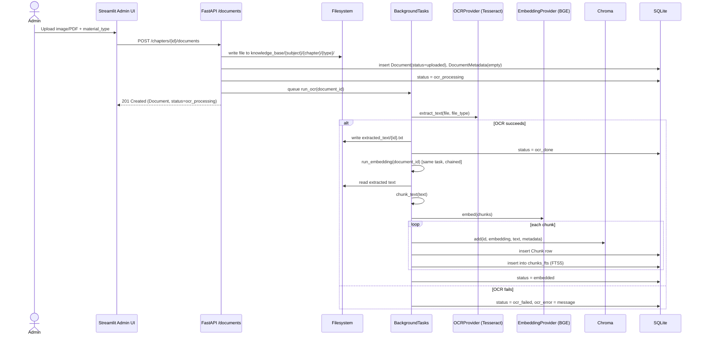
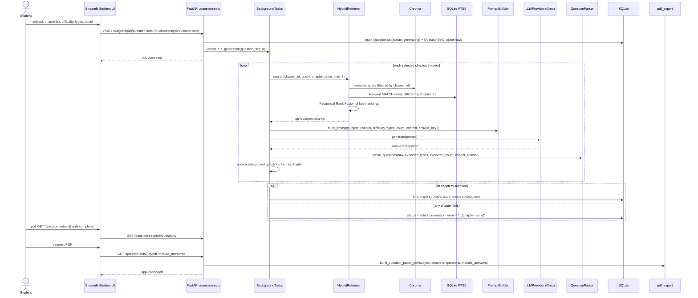

# EduGenAI — Technical Design Document

**Version:** 1.0
**Status:** Living document (reflects implemented code, not just the SRS plan)
**Related docs:** [`srs.md`](./srs.md) (product requirements) · [`features/README.md`](./features/README.md) (feature tracker, phase-by-phase status)
**Last reviewed:** 2026-07-23

> `srs.md` describes *intent*. This document describes the system *as built*: the
> actual services, data model, API surface, and data flows in `backend/` and
> `frontend/` as of Phase 5 (in progress). Where the implementation diverges
> from the original SRS (e.g. LLM provider choice), that divergence is called
> out explicitly with the reason.

---

## 1. Purpose & Scope

EduGenAI is an AI-powered practice-question-paper generator. An administrator
builds a per-chapter knowledge base (textbook pages, worksheets, sample
papers, notes) via OCR + a hybrid vector/keyword index; a student then picks
a subject, one or more chapters, a difficulty, question types, and a question
count, and the system retrieves relevant context and prompts an LLM to
generate a fresh, syllabus-bound practice paper with an optional answer key
and PDF export.

This document covers the system as implemented through Phase 5 (multi-chapter
generation, in progress). It does not cover Phase 6 (auth, multi-user,
deployment hardening), which is not yet designed.

---

## 2. Implementation Status

| Phase | Scope | Status |
|---|---|---|
| 1 — Foundation | Core infra, Subject mgmt, Chapter mgmt | Done |
| 2 — Knowledge Base | Upload/storage, OCR pipeline, metadata, chunking/embeddings, hybrid retrieval | Done |
| 3 — AI Question Generator | Groq LLM integration, prompt builder + generation engine, answer key, admin generator UI | Done |
| 4 — Student Portal | Student generator UI, PDF export, practice paper history | Done |
| 5 — Enhancements | Multi-chapter practice paper generation | In Progress |
| 6 — Deployment & Production | Auth, multi-user, VPS/Azure deployment, monitoring | Not started / not broken down |

See [`features/README.md`](./features/README.md) for the authoritative,
per-feature status and standing decisions (delete-is-block-not-cascade,
child-scoped uniqueness, no auth before Phase 6, etc.).

---

## 3. Architecture Overview



**Layering rationale:**

- **Streamlit UI** talks to FastAPI only over HTTP — no direct DB or filesystem
  access from the UI layer, so the backend can later be exposed to other
  clients (mobile, another frontend) without change.
- **FastAPI routers** are thin: they validate input, enforce 404/409 semantics,
  and hand off to services/pipelines. Business logic lives in `services/`.
- **Long-running work** (OCR, embedding, LLM generation) runs via FastAPI
  `BackgroundTasks` fired from the request handler, with the resource's
  `status` field (`ocr_processing` → `ocr_done`/`ocr_failed`, etc.) acting as
  the poll target — no external task queue (Celery/RQ) yet, since single-user
  local deployment doesn't need one.
- **Every external dependency that costs money or is heavy to run locally**
  (OCR engine, embedding model, LLM) sits behind a `typing.Protocol` interface
  with exactly one concrete implementation today, so swapping providers later
  (PaddleOCR, a cloud LLM, a hosted vector DB) touches one module, not callers.

---

## 4. Component Responsibilities

| Component | Location | Responsibility |
|---|---|---|
| Streamlit Admin pages | `frontend/pages/admin_*.py` | Subject/chapter CRUD, material upload, knowledge-base browsing/preview, admin-driven paper generation |
| Streamlit Student pages | `frontend/pages/student_*.py` | Practice paper generation form, generation status polling, history browsing, PDF download |
| `api/subjects.py`, `api/chapters.py` | `backend/app/api` | Subject/Chapter CRUD, chapter reordering, block-on-children delete semantics |
| `api/documents.py` | `backend/app/api` | Upload intake, storage-path management, OCR/embedding retry endpoints, metadata CRUD, chunk listing, document deletion (cleans up file + vector rows + FTS rows) |
| `api/questions.py` | `backend/app/api` | Single- and multi-chapter question-set creation, generation retry, history listing with per-chapter breakdown, PDF export |
| `api/llm.py` | `backend/app/api` | LLM provider health check |
| `services/ocr_pipeline.py` | `backend/app/services` | Runs OCR on a document, persists extracted text to disk, updates `Document.status`, chains into the embedding pipeline on success |
| `services/embedding_pipeline.py` | `backend/app/services` | Chunks extracted text, embeds chunks, writes to Chroma + `Chunk` table + FTS index |
| `services/retriever.py` | `backend/app/services` | Hybrid retrieval: semantic search (Chroma) + keyword search (SQLite FTS5), fused via Reciprocal Rank Fusion |
| `services/prompt_builder.py` | `backend/app/services` | Assembles the LLM prompt from subject/chapter/difficulty/question types/retrieved context |
| `services/generation_pipeline.py` | `backend/app/services` | Per-chapter retrieval → prompt → LLM call → parse → persist `Question` rows; marks `QuestionSet` `completed`/`failed` |
| `services/question_parser.py` | `backend/app/services` | Parses/validates raw LLM output into structured question records |
| `services/pdf_export.py` | `backend/app/services` | Renders a completed question set (optionally with answers) to PDF via `fpdf2` |
| `services/ocr.py`, `embeddings.py`, `llm.py` | `backend/app/services` | Provider interfaces + default implementations (Tesseract, Sentence-Transformers, Groq) |
| `services/vector_store.py` | `backend/app/services` | Chroma client/collection accessor |
| `services/search_index.py` | `backend/app/services` | SQLite FTS5 (`chunks_fts`) index/query/remove operations |
| `db/session.py` | `backend/app/db` | SQLAlchemy engine/session, `Base`, table creation on startup |

---

## 5. Data Model



**Notes:**

- `Chunk.text` is duplicated in Chroma's own document store; the SQL row is
  the join key back to relational metadata and the source for the FTS5
  keyword index (`chunks_fts`), which is *not* a SQLAlchemy model — it's a
  virtual table managed directly via raw SQL in `search_index.py`.
- `QuestionSet.chapter_id` is set only for single-chapter generations;
  multi-chapter sets rely entirely on `QuestionSetChapter` rows. This keeps
  the original single-chapter API contract (`QuestionSetRead.chapter_id`)
  working unchanged while Phase 5 adds the multi-chapter path.
- Deletes are blocked, not cascaded, at the Subject→Chapter boundary (409 if
  children exist) — a standing project decision to avoid silent data loss.
  Document deletion *does* cascade to its `Chunk` rows, Chroma vectors, and
  FTS rows, since those are wholly-owned derived artifacts of the document,
  not independent user data.

---

## 6. API Surface

All routes are unauthenticated (auth is deferred to Phase 6). Base URL:
`settings.backend_url` (default `http://127.0.0.1:8000`).

| Method | Path | Purpose |
|---|---|---|
| GET | `/health` | Liveness check |
| GET | `/llm/health` | LLM provider reachability check |
| POST / GET | `/subjects` | Create / list subjects |
| GET / PUT / DELETE | `/subjects/{id}` | Read / rename / delete (409 if chapters exist) |
| POST | `/subjects/{id}/chapters` | Add chapter (name unique within subject) |
| GET | `/subjects/{id}/chapters` | List chapters, ordered |
| PATCH | `/subjects/{id}/chapters/reorder` | Bulk reorder |
| GET / PUT / DELETE | `/chapters/{id}` | Read / rename / delete (409 if documents exist) |
| GET | `/chapters/{id}/search` | Ad-hoc hybrid search preview over a chapter's knowledge base |
| POST | `/chapters/{id}/documents` | Upload a file (image/PDF); stores it, queues OCR |
| GET | `/chapters/{id}/documents` | List documents in a chapter |
| GET / DELETE | `/documents/{id}` | Read / delete a document (cleans up file, chunks, vectors, FTS) |
| GET | `/documents/{id}/text` | Fetch OCR'd text |
| POST | `/documents/{id}/ocr/retry` | Retry a failed OCR run |
| GET | `/documents/{id}/chunks` | List a document's chunks |
| POST | `/documents/{id}/embeddings/retry` | Retry a failed embedding run |
| GET / PUT | `/documents/{id}/metadata` | Read / edit document metadata |
| POST | `/chapters/{id}/question-sets` | Generate a single-chapter practice paper (202, async) |
| POST | `/subjects/{id}/question-sets` | Generate a multi-chapter practice paper (202, async) |
| GET | `/chapters/{id}/question-sets` | List question sets for a chapter |
| GET | `/question-sets` | Global history, filterable by subject/chapter/status |
| GET | `/question-sets/{id}` | Read a question set (incl. status) |
| GET | `/question-sets/{id}/questions` | List generated questions |
| POST | `/question-sets/{id}/retry` | Retry a failed generation |
| GET | `/question-sets/{id}/pdf` | Export as PDF (`include_answers` query flag) |

---

## 7. Key Data Flows

### 7.1 Knowledge-base ingestion (Admin upload → searchable chunks)



The admin UI polls `GET /documents/{id}` for status; a failed OCR or
embedding run can be retried independently via the `/ocr/retry` or
`/embeddings/retry` endpoints without re-uploading the file.

### 7.2 Practice paper generation (Student request → PDF)



**Knowledge priority in the prompt** (per SRS §5, implemented in
`prompt_builder.py`): retrieved knowledge-base chunks are the primary source
context; the LLM's general knowledge fills gaps but is instructed to stay
within the selected chapter; live internet search is **not yet implemented**
(SRS Priority 3, `DuckDuckGo`/`Tavily` — deferred, no code exists for it yet).

---

## 8. Provider Abstraction Pattern

Every component that is either costly, heavy to install, or likely to be
replaced by a paid cloud service later is defined as a `typing.Protocol` with
one default implementation, all following the same shape:

```python
class XProvider(Protocol):
    def do_thing(self, ...) -> ...: ...

class DefaultXProvider:
    """Explains *why* this default was chosen over SRS alternatives."""
    ...

x_provider: XProvider = DefaultXProvider()
```

| Interface | Default implementation | SRS alternative(s) | Why the default was chosen |
|---|---|---|---|
| `OCRProvider` (`services/ocr.py`) | `TesseractOCRProvider` | PaddleOCR | Already available locally; PaddleOCR needs a deep-learning framework + model downloads |
| `EmbeddingProvider` (`services/embeddings.py`) | `SentenceTransformerEmbeddingProvider` (`BAAI/bge-small-en-v1.5`) | Nomic Embed | BGE small is free, local, and lazily loaded (no import-time cost/download) |
| `LLMProvider` (`services/llm.py`) | `OpenAICompatibleLLMProvider` — calls **any** OpenAI-compatible `chat/completions` API; defaults to Groq (`llama-3.3-70b-versatile`) | Local Ollama | Avoids multi-GB model download and local GPU/inference cost; a free-tier hosted API keeps this at zero operational cost while staying fast to iterate on |

**Switching LLM vendor is a config change, not a code change.** Groq, OpenAI,
OpenRouter, Together, Fireworks, and a local Ollama/vLLM server in
OpenAI-compat mode all speak the same `chat/completions` wire format, so
`OpenAICompatibleLLMProvider` calls all of them unmodified — only
`llm_api_key`, `llm_model`, and `llm_base_url` (env vars `LLM_API_KEY`,
`LLM_MODEL`, `LLM_BASE_URL`) need to change. Worked examples for Groq/OpenAI/
OpenRouter are in `.env.example`. Providers with a genuinely different wire
format (e.g. Anthropic's native Messages API) would still need a new
`LLMProvider` implementation — the `Protocol` interface makes that a
drop-in addition without touching `generation_pipeline.py` or callers.

Tests substitute stub implementations at the module-level `*_provider`
binding, so unit tests never hit a real OCR engine, embedding model, or LLM
API — only the "Manual Verification" checklists in the feature docs exercise
the real stack.

---

## 9. Storage Layout

```
knowledge_base/
  {subject_id}/
    {chapter_id}/
      textbook_page/      # raw uploaded files, by material_type
      worksheet/
      sample_paper/
      notes/
      question_paper/
      extracted_text/
        {document_id}.txt # OCR output
```

Paths are keyed by numeric ID, not by subject/chapter *name*, so renaming a
subject or chapter never breaks stored file paths. The top-level `storage/`
directory named in the original SRS folder scaffold is unused — Phase 2
consolidated everything under `knowledge_base/`.

`data/app.db` is the SQLite database (relational metadata + FTS5 keyword
index); the Chroma vector collection persists to its own local directory
under Chroma's default settings.

---

## 10. Technology Stack (as implemented)

| Layer | Technology | Notes |
|---|---|---|
| UI | Streamlit 1.41 | Multi-page app, separate admin/student page groups, no login |
| Backend | FastAPI 0.115 + Uvicorn | Thin routers, `BackgroundTasks` for async pipelines |
| ORM / DB | SQLAlchemy 2.0 (typed `Mapped[...]`) + SQLite | Also hosts an FTS5 virtual table for keyword search |
| LLM | Groq hosted API (`llama-3.3-70b-versatile`) | OpenAI-compatible; swapped in place of SRS's local-Ollama plan |
| OCR | Tesseract (`pytesseract`) + `pdf2image` | PaddleOCR left as a documented future swap |
| Vector DB | Chroma 1.0 | Local persistent collection, `where`-filtered by `chapter_id` |
| Embeddings | `sentence-transformers`, `BAAI/bge-small-en-v1.5` | Loaded lazily |
| Metadata DB | SQLite | Same DB file as relational data |
| Storage | Local filesystem | `knowledge_base/{subject_id}/{chapter_id}/...` |
| PDF export | `fpdf2` | Renders question paper (+ optional answer key) |
| Search (web) | *Not implemented* | SRS Priority-3 source; no code yet |
| Test framework | `pytest` (`pytest.ini`, 17 test files under `tests/`) | Providers stubbed at the module boundary |

No paid services are in use anywhere in the stack, consistent with the SRS
cost constraint (§13).

---

## 11. Non-Functional Design Notes

- **Modularity:** provider interfaces (§8) mean OCR/embedding/LLM/vector-store
  swaps are localized. The retrieval, prompt-building, and parsing layers are
  themselves separate modules so, e.g., swapping RRF for a reranker only
  touches `retriever.py`.
- **Resilience of pipelines:** every background pipeline stage records a
  terminal `*_failed` status plus a human-readable error string on the owning
  row (`Document.ocr_error`/`embedding_error`, `QuestionSet.generation_error`)
  and exposes an explicit `/retry` endpoint — failures are visible and
  recoverable from the UI, not silent.
- **No queue/worker infrastructure:** `BackgroundTasks` run in-process after
  the response is sent. This is adequate for a single local user but does not
  survive a server restart mid-pipeline, and does not horizontally scale —
  a real queue (Celery/RQ/Arq) is a Phase 6 concern if multi-user load
  requires it.
- **No authentication anywhere yet:** admin vs. student is a purely
  navigational split in the Streamlit app (separate pages), not an access
  control boundary. All API routes are open. This is an intentional,
  documented deferral (see `features/README.md`, Phase 4 note) — not an
  oversight — and must be resolved before any non-local deployment.
- **Single shared history:** because there's no user identity yet,
  `/question-sets` history is global, not per-student.

---

## 12. Known Gaps vs. the Original SRS

| SRS item | Status |
|---|---|
| §5 Priority 3 — optional internet search for style/trends | Not implemented |
| §8 top-level `storage/` folder | Superseded by `knowledge_base/{id}/{id}/...` layout |
| §11 Ollama as the LLM | Replaced with a config-driven, OpenAI-compatible hosted API — defaults to Groq (see §8 rationale) |
| §14 Phase 2/3 deployment (VPS/Azure) | Not started; still local-only |
| §15 "Secure" NFR | No auth, no input-sanitization audit performed yet |
| §16 Future enhancements (assessment, personalization, teacher features, analytics, multi-board) | Out of scope for all phases planned so far |

---

## 13. Next Steps

1. Finish Phase 5 (multi-chapter generation) — already in progress.
2. Design Phase 6: authentication/authorization, multi-user data isolation
   (history, knowledge base ownership), and a deployment target (VPS/Azure
   VM per SRS §14), plus whatever task-queue infrastructure that scale
   requires.
3. Revisit `CLAUDE.md`'s "Project State" section, which currently says
   *pre-implementation* — it should be updated to reflect Phases 1–4 being
   done and Phase 5 in progress, to keep it accurate for future sessions.
